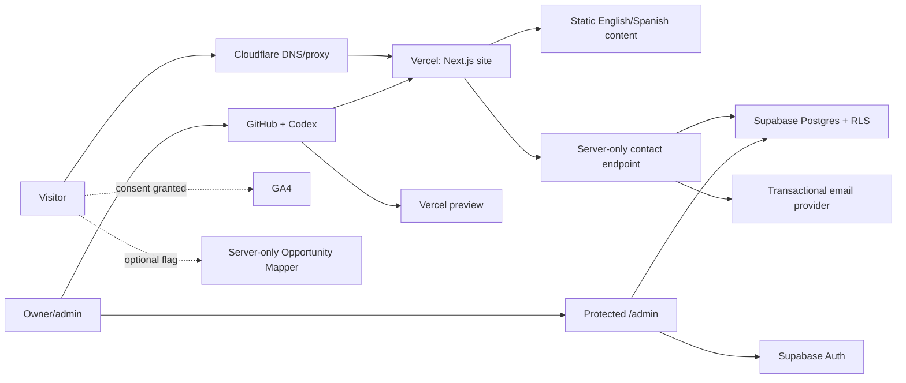

# Viste.ai Architecture Proposal

Status: Phase 0 recommendation; implementation requires explicit approval.

Primary goal: a stable, premium bilingual marketing and lead platform that a non-developer owner can operate through GitHub, Codex, Vercel, and Supabase.

## Decision

Use a single Next.js App Router application with strict TypeScript, server components by default, statically generated repository-owned content, and a very small server surface for contact submission and future administration.

Use:

- **GitHub** as the source of truth and review/rollback history.
- **Vercel** for previews, production hosting, server routes, headers, and deployment checks.
- **Supabase** for lead data, admin authentication, row-level security, and database migrations.
- **Google Search Console** for search migration and **GA4 only after consent**.
- **A transactional email provider** for reliable notifications/confirmations; this is simpler and safer than automating a personal Gmail mailbox. Provider selection remains open.
- **OpenAI only for the optional Opportunity Mapper**, disabled by default and not a launch dependency.

Do not add a CMS, UI framework, global state library, separate backend service, search service, or AI SDK at launch.

## Why this is the simplest stable option

- Marketing pages remain available even if Supabase, email, GA4, or OpenAI is unavailable.
- Content changes are ordinary reviewed Git changes, so the owner can ask Codex to edit them without learning a CMS.
- Vercel creates isolated preview deployments from non-production branches while `main` remains production.
- Supabase provides Postgres, Auth, migrations, and RLS in one owner-manageable service.
- Static generation, server components, `next/font`, and built-in metadata/image features minimize client JavaScript and third-party runtime calls.
- A single application keeps routing, SEO, forms, validation, tests, and operations in one repository.

At Phase 1 kickoff, pin the latest supported stable releases of Next.js, React, TypeScript, and each dependency after reviewing release/security notes. Do not use prereleases or floating runtime versions.

## System context



Cloudflare and existing DNS remain unchanged through preview review. Their launch role should remain routing/proxy only unless an owner-approved change is justified.

## Rendering and content architecture

- English is the root locale; Spanish lives under `/es`.
- A typed route manifest owns paths, translation keys, metadata, indexability, breadcrumbs, and sitemap inclusion.
- Core copy lives in focused TypeScript content modules; long-form insights use MDX with validated frontmatter.
- Reusable page templates render service, solution, and industry detail pages from typed content.
- `generateStaticParams` and static rendering produce all approved marketing pages at build time.
- Unknown slugs call `notFound()`; drafts never generate routes.
- Translation parity tests ensure every published route has an approved counterpart or an explicit exception.
- Legal drafts include version, effective date, reviewer status, and a build-time publication gate.

This model is slightly more structured than copying page files, but it makes owner-requested text changes safe: one content object changes the page, metadata, navigation, and sitemap consistently.

## Proposed file structure

```text
.
├── .env.example                       # placeholders only; Phase 1
├── .github/
│   ├── CODEOWNERS
│   ├── dependabot.yml
│   └── workflows/ci.yml
├── public/
│   ├── brand/                         # approved optimized logos/icons
│   ├── images/
│   │   ├── industries/
│   │   └── solutions/
│   ├── manifest.webmanifest
│   └── .well-known/security.txt       # generated/configured contact
├── supabase/
│   ├── migrations/
│   ├── seed.sql                       # synthetic local data only
│   └── tests/
├── src/
│   ├── app/
│   │   ├── (marketing)/
│   │   │   ├── page.tsx
│   │   │   ├── services/
│   │   │   │   ├── page.tsx
│   │   │   │   └── [slug]/page.tsx
│   │   │   ├── solutions/
│   │   │   │   ├── page.tsx
│   │   │   │   └── [slug]/page.tsx
│   │   │   ├── industries/
│   │   │   │   ├── page.tsx
│   │   │   │   └── [slug]/page.tsx
│   │   │   ├── insights/
│   │   │   │   ├── page.tsx
│   │   │   │   └── [slug]/page.tsx
│   │   │   ├── partners/page.tsx
│   │   │   ├── process/page.tsx
│   │   │   ├── about/page.tsx
│   │   │   ├── contact/page.tsx
│   │   │   ├── privacy/page.tsx
│   │   │   ├── terms/page.tsx
│   │   │   ├── cookies/page.tsx
│   │   │   └── security/page.tsx
│   │   ├── es/                         # thin route adapters using ES manifest
│   │   │   ├── page.tsx
│   │   │   └── [...slug]/page.tsx
│   │   ├── admin/                      # Phase 3; authenticated, noindex
│   │   ├── api/
│   │   │   ├── contact/route.ts
│   │   │   └── opportunity-map/route.ts # later, flag-protected
│   │   ├── layout.tsx
│   │   ├── not-found.tsx
│   │   ├── error.tsx
│   │   ├── robots.ts
│   │   └── sitemap.ts
│   ├── components/
│   │   ├── analytics/
│   │   ├── consent/
│   │   ├── forms/
│   │   ├── layout/
│   │   ├── seo/
│   │   └── ui/
│   ├── content/
│   │   ├── en/
│   │   │   ├── pages/
│   │   │   ├── services/
│   │   │   ├── solutions/
│   │   │   ├── industries/
│   │   │   └── insights/
│   │   ├── es/
│   │   │   └── ...
│   │   ├── legal/
│   │   ├── navigation.ts
│   │   └── routes.ts
│   ├── lib/
│   │   ├── analytics/
│   │   ├── env/
│   │   ├── forms/
│   │   ├── i18n/
│   │   ├── rate-limit/
│   │   ├── seo/
│   │   ├── security/
│   │   └── supabase/
│   ├── styles/
│   │   ├── globals.css
│   │   └── tokens.css
│   └── types/
├── tests/
│   ├── e2e/
│   ├── accessibility/
│   ├── links/
│   └── unit/
├── docs/
├── AGENTS.md
├── next.config.ts
├── package.json
├── playwright.config.ts
└── tsconfig.json
```

The Spanish catch-all is a thin adapter over a finite validated route manifest, not an open dynamic router. It provides natural Spanish slugs without duplicating the full component tree.

## Contact submission flow

1. Client renders an accessible form without requiring JavaScript for initial content.
2. Browser adds source URL, referrer, and allowed UTM fields.
3. Server endpoint enforces origin/method/content-type/body-size limits.
4. A maintained schema validates and normalizes fields; work email is not over-restricted.
5. Honeypot and elapsed-time checks reject obvious bots.
6. Rate limiting uses a privacy-preserving IP hash with short retention. Prefer Vercel-native controls if available on the owner plan; otherwise use a minimal Supabase RPC/table design. Add Turnstile only if abuse warrants the extra service.
7. Server writes to Supabase with a server-only secret key; the browser never writes directly to `leads`.
8. After durable storage, notification and confirmation emails are attempted and logged as events. Email failure must not discard a stored lead.
9. Visitor receives a generic success response and booking CTA; internal errors and database details are never exposed.
10. Duplicate/replay strategy and retention are documented and tested.

## Supabase design

Initial tables from the blueprint:

- `leads`
- `lead_notes`
- `lead_events`
- `admin_users` or an equivalent profile/allowlist tied to Supabase Auth

Add only small operational support tables when justified, for example `rate_limit_buckets` and `admin_audit_log`.

Security model:

- RLS enabled on every public-schema table.
- No anonymous reads or direct anonymous lead inserts.
- New Supabase **publishable** and **secret** keys are preferred over legacy `anon`/`service_role` names where the account supports them.
- Secret key is imported only from a server-only module and never uses a `NEXT_PUBLIC_` prefix.
- Admin access requires Supabase Auth plus an explicit allowlist/role check; public registration is disabled.
- Admin mutations create audit events.
- Migrations are versioned and tested; production schema changes are reviewed separately.
- Backup, point-in-time recovery availability, export, retention, and restoration are documented before leads are accepted.

## Email decision

Recommended default: a dedicated transactional provider with domain authentication, configured through environment variables. It offers clearer delivery logs, retries, and separation from personal mailboxes than Gmail automation.

Open decision: select the provider after confirming the owner's domain/email setup, data-processing needs, pricing, and region. If Google Workspace must be used, use a supported server-side API/service-account or OAuth design owned by the business; do not embed mailbox passwords or rely on personal-calendar links.

## Analytics and Google services

- Search Console is justified before and after migration because redirects and indexed-page continuity are high-risk.
- GA4 is optional but useful for the blueprint's conversion taxonomy. It must not load until the correct consent state.
- Google Consent Mode may be used only if its behavior and legal basis are approved; it does not replace consent design.
- No Google Maps, reCAPTCHA, Tag Manager, or other Google product is required at launch.
- Fonts load through `next/font` and are self-hosted in the build, avoiding runtime Google font requests.

## Optional OpenAI feature

`NEXT_PUBLIC_ENABLE_OPPORTUNITY_MAPPER=false` by default. Do not install or call OpenAI in Phases 1–3 unless separately approved.

If later enabled:

- call only from a server route;
- validate/moderate and strictly limit input/output;
- warn against confidential/personal data;
- store nothing without explicit consent;
- apply rate and cost limits;
- return a preliminary, non-professional assessment notice;
- provide human CTA and audit-safe error handling.

## Security baseline

- Strict TypeScript and centralized environment validation.
- Server/client import boundaries enforced in lint/tests.
- CSP with nonces/hashes as required; no `unsafe-eval` in production.
- HSTS, content-type sniffing protection, frame-ancestor protection, restrictive referrer/permissions policies.
- Dependency lockfile, Dependabot, minimal packages, and review of install scripts.
- Zod or another maintained schema validator for forms and env configuration.
- Size/time/rate limits, spam protection, generic errors, and structured logs without form bodies.
- Supabase RLS and auth tests.
- Protected previews if they contain real data; preview database/email configuration must use isolated or non-delivering resources.
- `/.well-known/security.txt` generated only after a verified security contact exists.

## Testing and CI

Required scripts:

```text
lint
typecheck
test
test:e2e
build
check:links
```

Pull-request CI runs install-from-lockfile, lint, typecheck, unit tests, build, route/metadata/link checks, accessibility smoke tests, and core Playwright flows. Required checks block merge to `main`.

Core test coverage:

- EN/ES routes and hreflang parity;
- legacy redirects;
- contact validation, success, rate-limit, spam, and email-failure behavior;
- admin authentication/authorization;
- 404 and error handling;
- metadata and structured data;
- cookie choices and analytics gating;
- keyboard navigation and automated accessibility;
- security headers and no secret material in client output.

## GitHub and Vercel workflow

1. Preserve legacy tag and archive branch at `bdfb68b`.
2. Work only on `rebuild/viste-ai-global` and short-lived child feature branches if needed.
3. Push a reviewed branch and open a pull request to `main` only when Phase 1/2 preview work is authorized.
4. Vercel deploys non-production branches to Preview; Preview-scoped environment variables contain test resources only.
5. Verify preview `noindex`, protection, mobile, SEO, forms, security, bilingual routes, and redirects.
6. Require explicit owner approval before merge.
7. Merge to `main` is the only normal production trigger. No manual “promote to production,” DNS edit, or production-domain reassignment without approval.

Before any branch is pushed, verify in Vercel that `main` is actually configured as the production branch. This is the only deployment-setting fact that blocks safe remote publication.

## Environment-variable inventory

Names only; values must live in local untracked `.env.local` and Vercel's scoped secret store.

### Required for public site/lead flow

```text
NEXT_PUBLIC_SITE_URL
NEXT_PUBLIC_BOOKING_URL
NEXT_PUBLIC_SUPABASE_URL
NEXT_PUBLIC_SUPABASE_PUBLISHABLE_KEY
SUPABASE_SECRET_KEY
CONTACT_NOTIFICATION_TO
CONTACT_FROM_EMAIL
EMAIL_PROVIDER_API_KEY
CONTACT_IP_HASH_SALT
```

If the existing Supabase account only offers legacy keys, use `NEXT_PUBLIC_SUPABASE_ANON_KEY` and `SUPABASE_SERVICE_ROLE_KEY` temporarily and document migration. Never expose the elevated key.

### Optional/conditional

```text
NEXT_PUBLIC_GA_MEASUREMENT_ID
NEXT_PUBLIC_ENABLE_ANALYTICS
NEXT_PUBLIC_ENABLE_OPPORTUNITY_MAPPER
OPENAI_API_KEY
OPENAI_MODEL
NEXT_PUBLIC_TURNSTILE_SITE_KEY
TURNSTILE_SECRET_KEY
```

Provider-specific names should replace the generic email names at implementation once the provider is selected. `.env.example` contains placeholders only.

## Required accounts and access

| Account | Required when | Minimum access/purpose |
|---|---|---|
| GitHub organization/repository | Now | Branch/tag push, branch protection, PR checks |
| Vercel project/team | Before first push/preview | Verify production branch, preview env/protection, deployment logs |
| Supabase project | Phase 3 (earlier for preview planning) | Database, Auth, migrations, backups |
| Domain DNS/Cloudflare | Launch only | Verification and emergency rollback; no Phase 0 changes |
| Google Search Console | Before redirect approval | Index/export/validation |
| GA4 | When analytics approved | Measurement stream only after consent |
| Transactional email provider | Phase 3 | Domain-authenticated notifications and confirmations |
| OpenAI | Optional Phase 4 | Server-only mapper; not required for launch |

## Decisions that block implementation or safe publication

Before Phase 1 content/legal work:

- Approve this stack and repository-owned content model.
- Approve canonical Spanish slugs and public pricing posture.
- Confirm verified brand, company, team, contact, and legal facts.
- Decide whether historical guest terms must stay at the same URLs or move to a legal archive.

Before pushing branches / creating a preview:

- Verify Vercel's production branch is `main` and non-`main` branches are Preview only.
- Decide whether the preview must be protected and ensure Preview env values cannot email customers or write production lead data.

Before Phase 3:

- Select Supabase project/region, email provider, admin users, retention/backup policy, and rate-limit approach.

Before launch:

- Complete legal review, Search Console inventory, redirect approval, environment separation, full QA, and explicit production approval.

## Rejected launch architecture

- A headless CMS: additional account, permissions, schema, previews, and failure modes with little benefit for current editorial volume.
- Direct browser-to-Supabase lead inserts: unnecessary public database surface.
- A separate Express/Nest backend: duplicates Vercel/Next server capability.
- Heavy component or animation frameworks: higher bundle and ownership cost.
- WebGL hero: poor launch tradeoff for performance/accessibility.
- OpenAI-generated marketing copy or live AI as a core dependency: introduces cost, safety, privacy, and reliability without improving the baseline site.
