# VIS_010 / Viste Opportunity Engine

Status: first production-oriented vertical slice implemented on a non-production branch. Provider credentials, database migration, preview review and owner approval are still required before production use.

## Decision

Implement Viste first inside the existing Next.js application. Keep every commercial record tenant-keyed and every external service behind a provider boundary so DeepBridge Advisory, Beyer Licensing and later ventures can be added without copying an agent into each website.

VIS_010 is not a generic chatbot and does not autonomously contact prospects. The first slice uses deterministic classification and scoring, produces a structured Viste Opportunity Brief, and hands control to a person. Model-assisted knowledge and drafting can be introduced later behind the same server boundary after approved knowledge, OpenAI credentials, tracing and evaluation gates are configured.

## System names

- System: VIS_010 / Viste Opportunity Engine
- Customer experience: Viste AI Opportunity Advisor
- Internal application: Viste Opportunity Control
- Stored artifact: Viste Opportunity Brief
- Primary destination: AI Opportunity Sprint or the mapped service-specific discovery session

## Data flow

```mermaid
flowchart LR
  V["Website visitor"] --> L["Bilingual advisor launcher"]
  L --> A["Adaptive diagnostic"]
  A --> C["Config-driven intent classification"]
  A --> S["Deterministic 100-point score"]
  C --> B["Opportunity Brief"]
  S --> B
  B --> P["Progressive contact + explicit consent"]
  P --> R["Rate-limited server route"]
  R --> F["Atomic Supabase function"]
  F --> T["Tenant-scoped opportunity data"]
  F --> AU["Consent, attribution and audit records"]
  T --> O["Authenticated Opportunity Control"]
  O --> H["Senior practitioner review"]
  H -. "explicit confirmation" .-> CAL["Calendar adapter"]
  H -. "approval + suppression check" .-> FU["Follow-up adapter"]
  WA["Future WhatsApp Business webhook"] -. "signed + idempotent" .-> R
  K["Future approved knowledge"] -. "tenant-scoped retrieval" .-> A
  AI["Future bounded OpenAI workflow"] -. "structured output + traces" .-> C
```

## Trust boundaries

1. Browser input, page content, query parameters, uploaded material and provider webhooks are untrusted.
2. The browser never receives Supabase service credentials, email credentials, webhook secrets or OpenAI keys.
3. The browser can preview a score, but the server recomputes intent, score, priority, risk route and service recommendation before storage.
4. `create_viste_opportunity` writes contact, opportunity, diagnostic, score, consent, attribution and audit records in one database transaction.
5. Every commercial table has a `tenant_id`, RLS is enabled, and authenticated reads require membership of that tenant.
6. Marketing follow-up, CRM changes, pricing, proposals and delivery commitments have explicit approval record types. No sending implementation exists in this slice.

## Deterministic score

| Component | Weight |
| --- | ---: |
| Problem clarity | 15 |
| Operational frequency | 10 |
| Measurable impact | 20 |
| Process ownership | 10 |
| Systems/data readiness | 10 |
| Timeline urgency | 10 |
| Commercial readiness | 10 |
| Viste service fit | 15 |

Routes are fixed at 80–100 P1, 65–79 P2, 45–64 P3 and below 45 P4. Risk remains LOW, MEDIUM or HIGH and never changes the mathematical total. High-risk and existing-client enquiries route to human review.

## Current integration truth

| Capability | Current state | Production truth |
| --- | --- | --- |
| Supabase lead storage | Implemented, credential-dependent | Existing secure contact form uses service-side storage. VIS_010 needs migrations `202608110001_vis_010_opportunity_engine.sql` and `202608110002_vis_010_analytics_and_abuse.sql`. |
| Supabase Auth | Implemented, credential-dependent | Magic-link sign-in protects admin APIs; membership or existing admin allowlist is checked server-side. |
| Resend notification | Implemented for legacy form, credential-dependent | No VIS_010 outbound email is sent in this slice. |
| Calendar | Link-only | A configured HTTPS booking URL may be returned to a qualified, low/medium-risk user. Availability and booking APIs are not implemented. |
| WhatsApp | Link-only plus illustrative UI | No WhatsApp Business Platform webhook or sending credential is configured. Adapter boundary exists. |
| CRM | Not integrated | Opportunity Control does not claim to write a CRM. Changes require approval when an adapter is added. |
| OpenAI | Not in request path | Environment placeholders exist. No SDK call is made until an approved server adapter, model, tracing and eval threshold are configured. |
| Analytics | Implemented, consent-gated | Vercel measurement only loads after optional analytics consent; opportunity attribution is first-party operational data and contains no visitor fingerprint. |
| Bot protection | Layered basic; Turnstile optional | Honeypot, elapsed-time, memory and database limits run without a provider. Turnstile becomes fail-closed when its server secret is configured. |
| Opportunity reporting | Implemented, migration-dependent | Opportunity Control reports consented funnel stages, operational submissions, intent/source/language mix and aggregate blocked attempts without storing free text or raw IP data. |

## Phased task list

### Phase 1 — repository slice (implemented)

- Viste intent taxonomy and real service mapping
- adaptive English/Spanish advisor
- deterministic score and human-risk routing
- structured Opportunity Brief
- server validation, origin check, payload cap and rate limit
- tenant-keyed Supabase schema, RLS, consent, attribution and audit
- authenticated KPI, pipeline, brief, evidence and approval views
- 60-case bilingual regression evaluation
- calendar, WhatsApp and follow-up provider interfaces

### Phase 2 — configured preview

- apply migration to an isolated Supabase Preview project
- add owner/admin memberships and test RLS with at least two synthetic tenants
- configure the approved booking provider and replace link-only booking with slot/confirmation flow
- reconcile one full advisor submission against all database records
- add durable job provider selection for approved follow-up
- complete mobile, keyboard, screen-reader and abuse review in Vercel Preview

### Phase 3 — bounded model assistance

- approve and publish Viste knowledge sources and claims
- add the OpenAI Agents SDK only in a server adapter
- require schema-validated intent/brief output and preserve deterministic final scoring
- add policy guardrails, tenant-scoped retrieval, traces and resumable approvals
- establish an agreed routing threshold against the 60-case baseline before enabling the adapter
- keep the deterministic path as the outage fallback

### Phase 4 — channel and portfolio expansion

- signed/idempotent WhatsApp Business Platform webhook
- Google Calendar availability plus explicit booking confirmation
- approval-gated follow-up with suppression, quiet hours and frequency caps
- synthetic DeepBridge and Beyer isolation tests before adding either real tenant
- expand portfolio views only after user memberships and tenant-specific content are approved

## Architecture decision record

ADR-VIS-010-001: keep VIS_010 in the existing Next.js deployment for the first tenant. This preserves the validated bilingual design system, contact fallback, consent controls and deployment rollback path. Split the central SalesOS application only when independent release cadence, widget distribution or portfolio authorization creates a demonstrated boundary. Database tenancy and provider interfaces are present now, so that split will not require changing the commercial domain model.
